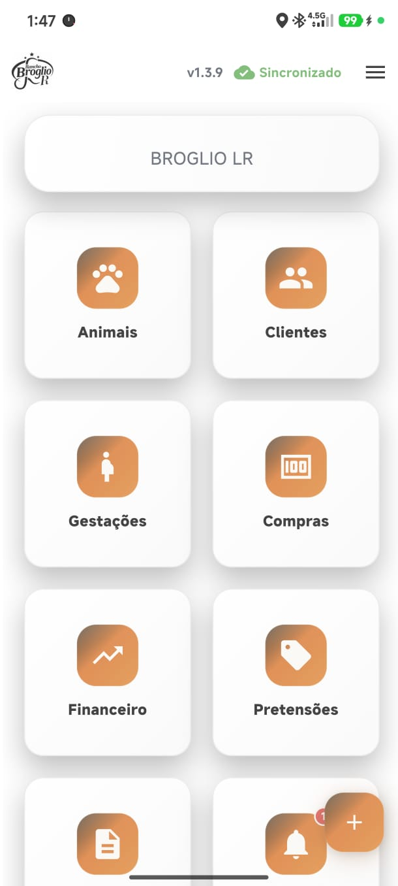
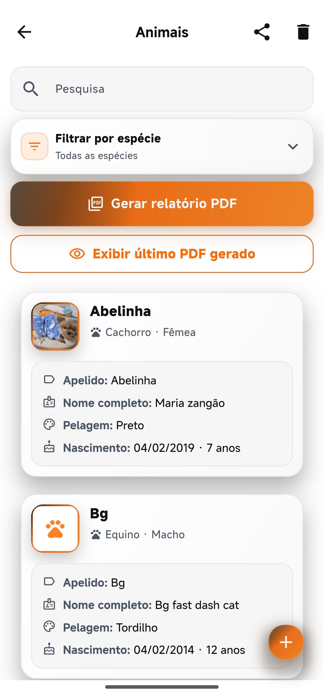
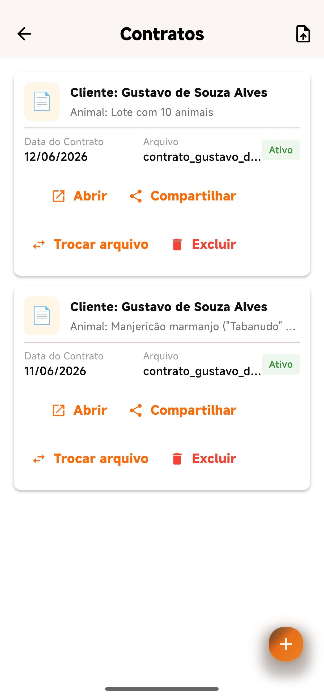
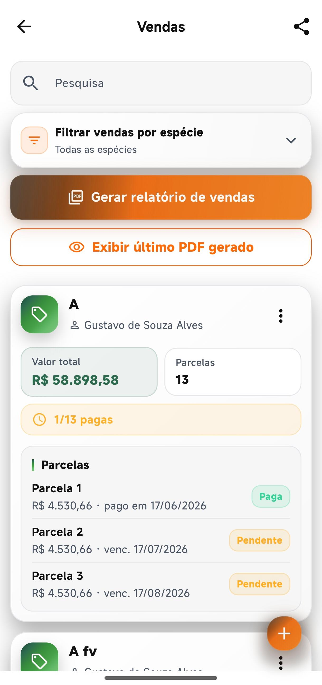

# Haras Manager


> **Case de Transformação Digital** — Plataforma mobile para gestão integrada de haras, desenvolvida com foco em operação, processos e tomada de decisão.

[](https://flutter.dev)
[](./docs/architecture.md)
[](./docs/roadmap.md)

---

## Descrição Executiva

O **Haras Manager** é uma solução mobile de gestão operacional e comercial voltada ao setor equestre. O sistema centraliza informações de animais, reprodução, saúde, finanças, clientes e documentos em um único ambiente digital, substituindo planilhas, anotações dispersas e controles manuais por um fluxo integrado, rastreável e orientado a indicadores.

O projeto nasceu da necessidade real de proprietários e gestores de haras que precisavam de visibilidade sobre custos, gestações, vendas e saúde do rebanho — com operação em campo, conectividade intermitente e exigência de confiabilidade dos dados.

> **Nota:** Este repositório é um **showcase de portfólio**. Não contém código-fonte, credenciais ou dados operacionais. Para detalhes técnicos e funcionais, consulte a documentação em [`/docs`](./docs).

---

## Problema que o Sistema Resolve

| Desafio Operacional | Impacto | Solução Entregue |
|---|---|---|
| Dados espalhados em planilhas e cadernos | Perda de informação e retrabalho | Cadastro unificado e sincronização em nuvem |
| Falta de visibilidade financeira | Decisões reativas e sem base | Dashboard financeiro com KPIs mensais |
| Controle manual de gestações e reprodução | Risco de perda de marcos críticos | Módulo de reprodução com marcos e alertas |
| Documentos e contratos desorganizados | Risco jurídico e comercial | Geração e armazenamento documental estruturado |
| Operação offline em áreas rurais | Interrupção do fluxo de trabalho | Cache local com sincronização inteligente |

---

## Minha Atuação

Atuei de forma **end-to-end** na concepção, arquitetura e evolução do produto, conectando visão de negócio, engenharia de processos e desenvolvimento de software.

| Área | Responsabilidade |
|---|---|
| **Levantamento de requisitos** | Entrevistas com usuários, mapeamento de fluxos operacionais e priorização de funcionalidades |
| **Planejamento funcional** | Definição de módulos, jornadas de uso e critérios de aceite |
| **Arquitetura da solução** | Modelagem em camadas, separação de domínios e estratégia offline-first |
| **Modelagem de banco de dados** | Estruturação de entidades, relacionamentos e regras de sincronização |
| **Desenvolvimento Flutter** | Implementação de interfaces, lógica de negócio e experiência mobile |
| **Integrações Firebase** | Autenticação, persistência em nuvem e armazenamento de arquivos |
| **Integrações REST API** | Serviços externos para emissão de boletos e distribuição de atualizações |
| **Versionamento Git/GitHub** | Controle de versão, branches e histórico de evolução do produto |
| **Aplicação de SOLID** | Princípios de design para código modular e testável |
| **Aplicação de Clean Architecture** | Separação entre domínio, dados e apresentação |
| **Evolução contínua do produto** | Iterações incrementais com feedback operacional e melhoria contínua |

---

## Tecnologias Utilizadas

| Camada | Tecnologias |
|---|---|
| **Frontend Mobile** | Flutter, Dart |
| **Gerenciamento de Estado** | Riverpod |
| **Persistência Local** | Hive |
| **Backend & Nuvem** | Firebase (Auth, Firestore, Storage) |
| **Integrações** | REST API, HTTP/Dio |
| **Documentos** | Geração de PDF nativa |
| **Notificações** | Push locais e agendamento de lembretes |
| **Gráficos & Dashboards** | Biblioteca de charts para KPIs |
| **Controle de Versão** | Git, GitHub |
| **Qualidade** | Testes unitários, linting, análise estática |

---

## Arquitetura Utilizada

O sistema adota **Clean Architecture** com organização por features, garantindo escalabilidade, manutenibilidade e independência entre camadas.

```
┌─────────────────────────────────────────────────────────┐
│                    Apresentação (UI)                    │
│              Widgets · Pages · Providers                │
├─────────────────────────────────────────────────────────┤
│                      Domínio                            │
│         Entities · Use Cases · Repositories (abs)       │
├─────────────────────────────────────────────────────────┤
│                       Dados                             │
│    Repositories (impl) · Data Sources · Models · Hive   │
├─────────────────────────────────────────────────────────┤
│                   Infraestrutura                        │
│         Firebase · REST APIs · Sync · Connectivity      │
└─────────────────────────────────────────────────────────┘
```

Principais padrões aplicados:

- **Clean Architecture** — separação clara de responsabilidades
- **Repository Pattern** — abstração de fontes de dados
- **Offline-first** — operação local com fila de sincronização
- **Feature-based modules** — domínios isolados e coesos

Documentação completa: [`docs/architecture.md`](./docs/architecture.md)

---

## Principais Funcionalidades

| Módulo | Descrição Resumida |
|---|---|
| 🐎 **Gestão de Animais** | Cadastro completo, pedigree, fotos, status reprodutivo e histórico |
| 🤰 **Reprodução** | Controle de gestações, cruzamentos e marcos reprodutivos |
| 🏥 **Saúde Animal** | Exames, procedimentos, vacinas e acompanhamento clínico |
| 💰 **Financeiro** | Dashboard, vendas, compras, parcelas e status de pagamentos |
| ⚙️ **Gestão Operacional** | Insumos, custos recorrentes, clientes e lembretes |
| 📄 **Gestão Documental** | Contratos PDF, catálogos comerciais e upload de documentos |
| 📊 **Dashboards** | KPIs financeiros e operacionais com visão mensal |
| 📋 **Relatórios** | Relatórios consolidados exportáveis e compartilháveis |

Detalhamento completo: [`docs/features.md`](./docs/features.md)

---

## Benefícios Operacionais

- **Centralização da informação** — um único ponto de verdade para todo o haras
- **Redução de retrabalho** — eliminação de duplicidade entre planilhas e anotações
- **Visibilidade financeira** — acompanhamento de receitas, despesas e margens por período
- **Rastreabilidade reprodutiva** — histórico completo de gestações, partos e cruzamentos
- **Operação em campo** — uso offline com sincronização automática ao reconectar
- **Agilidade comercial** — geração rápida de catálogos, contratos e propostas
- **Conformidade documental** — contratos padronizados com layout profissional
- **Proatividade operacional** — lembretes e alertas para marcos críticos

---

## Diferenciais do Projeto

1. **Produto real em produção** — desenvolvido e evoluído com base em operação real de haras
2. **Arquitetura enterprise em app mobile** — Clean Architecture e SOLID aplicados de forma prática
3. **Estratégia offline-first** — fila de sincronização, cache local e listeners em tempo real
4. **Integração financeira operacional** — vínculo entre animais, vendas, compras e fluxo de caixa
5. **Geração documental avançada** — PDFs de contratos, catálogos e relatórios financeiros
6. **Experiência orientada ao gestor** — dashboards e KPIs pensados para tomada de decisão
7. **Evolução contínua** — distribuição OTA de atualizações e roadmap estruturado
8. **Visão multidisciplinar** — une engenharia, processos, gestão e tecnologia

---

## Roadmap Futuro

| Fase | Iniciativa | Objetivo |
|---|---|---|
| 🔮 Curto prazo | Dashboards avançados | Drill-down por animal, cliente e período |
| 🤖 Médio prazo | IA para análise operacional | Insights automáticos sobre custos e reprodução |
| 📈 Médio prazo | Indicadores preditivos | Projeções de fluxo de caixa e partos |
| 🌐 Longo prazo | Aplicativo Web | Gestão multiplataforma para equipes |
| 📦 Longo prazo | Gestão de estoque | Controle de insumos com alertas de reposição |
| 🔗 Longo prazo | Integração financeira | Conciliação bancária e ERPs |

Roadmap detalhado: [`docs/roadmap.md`](./docs/roadmap.md)

---

## Screenshots

| Tela | Descrição |
|---|---|
|  | **Tela inicial** — hub central com acesso a todos os módulos |
|  | **Gestão de animais** — cadastro, filtros e detalhes |
|  | **Reprodução** — acompanhamento de gestações e marcos |
|  | **Dashboard financeiro** — KPIs e visão mensal |
|  | **Gestão documental** — contratos e catálogos PDF |
|  | **Relatórios** — consolidação e compartilhamento |

---

## Competências Demonstradas

Este projeto evidencia experiência prática e aplicada nas seguintes competências:

| Competência | Evidência no Projeto |
|---|---|
| **Gestão de Projetos** | Condução end-to-end desde requisitos até entrega e evolução |
| **Planejamento e Controle** | Roadmap, priorização de backlog e acompanhamento de entregas |
| **Engenharia de Processos** | Mapeamento de fluxos operacionais do haras para o sistema |
| **Transformação Digital** | Digitalização de processos manuais em solução integrada |
| **Desenvolvimento de Sistemas** | Aplicação mobile completa com múltiplos módulos |
| **Arquitetura de Software** | Clean Architecture, SOLID e padrões de projeto |
| **Banco de Dados** | Modelagem de entidades, sincronização e persistência híbrida |
| **Integração de Sistemas** | Firebase, REST APIs e serviços de terceiros |
| **Melhoria Contínua** | Iterações incrementais baseadas em feedback operacional |
| **Resolução de Problemas** | Soluções para offline, sync, PDF e fluxos complexos |
| **Metodologias Ágeis (Scrum)** | Sprints, entregas incrementais e refinamento contínuo |

---

## Documentação

| Documento | Conteúdo |
|---|---|
| [`docs/features.md`](./docs/features.md) | Descrição detalhada de todos os módulos |
| [`docs/architecture.md`](./docs/architecture.md) | Arquitetura técnica e padrões aplicados |
| [`docs/roadmap.md`](./docs/roadmap.md) | Melhorias futuras e visão de produto |

---

## Contato

Este repositório serve como **portfólio profissional**. Para conversar sobre o projeto, oportunidades ou demonstração ao vivo, entre em contato via perfil profissional ou LinkedIn.

---

<p align="center">
  <sub>Haras Manager — Transformação digital aplicada à gestão equestre.</sub>
</p>
